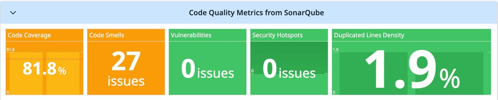

# SCM-DD-CREATOR

A GitHub custom action that's going to help you on generating the source-code metrics dashboard in your designated Datadog based on your given inputs such as `component-name`, etc.
By default, the dashboard will be pulling and showing you these following code quality metrics:

- code coverage
- code smells
- vulnerabilities
- security hotspots
- duplicated lines density



As for collecting those code metrics from your Sonarqube to Datadog, please use this  action.

## Inputs

### `sonar-base-url`

**Required** Sonarqube Base URL.

### `dd-base-url`

**Required** Datadog Base URL.

### `dd-api-key`

**Required** Your DataDog API Key. Get it from your DataDog subscription.

### `dd-application-key`

**Required** Your DataDog Application Key. Get it from your DataDog subscription.

### `component-name`

**Required** The component name (could be a project name or a service name).

### `dashboard-title`

**Required** The title for your Dashboard.

### `dashboard-author`

**Required** The Dashboard author name.

## Example Usage

```yaml
uses: yauritux/scm-dd-creator@v1.0
with:
  sonar-base-url: ${{ secrets.DD_SONAR_URL }}
  dd-base-url: ${{ secrets.DD_BASE_URL }}
  component-name: platform-api
  dd-api-key: ${{ secrets.DD_API_KEY}}
  dd-application-key: ${{ secrets.DD_APPLICATION_KEY}}
  dashboard-title: Sonar Code Quality Metrics
  dashboard-author: yauritux@gmail.com
```
